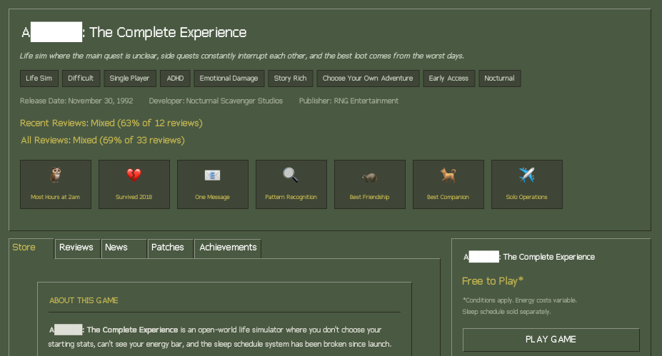

I started making small games. Not as a career change or anything - I just need creative projects that aren't my day job, and games are more interesting to me than writing blog posts.[^irony]

The first one is already out: [The Review](/games/the-review/).

What if a life had a Steam store page? Patch notes from v0.0, locked achievements, reviews from different perspectives, and a sleep schedule DLC that's been "coming soon" for decades. Retro Steam aesthetic using [cs16.css](https://cs16.samke.me/). Easter eggs for those who click around. It took one evening to build.

## Why games though?

Writing describes things. Games make you *do* things. There's something about interaction that hits different - you're not just reading about a situation, you're in it, making choices, feeling the consequences. That's interesting to me.

And the key word is *small*. A weekend web project, not a two-year commitment where I burn out halfway through and never touch it again. Ship something, learn something, move on.

## The ADHD brain needs novelty

Here's the thing - doing the same thing repeatedly kills my motivation. If I built ten games in the same engine with the same workflow, I'd abandon the project by game three. So each one uses whatever tech fits the idea:

- The Review was vanilla HTML/CSS with cs16.css for the retro Steam look
- Future ones might use Godot, Twine, canvas, WebGL, whatever

But it's not just about game engines. Everything around making a game is a learning opportunity - procedural music, pixel art, accessibility,[^a11y] shader effects, narrative design. If I already know how to do something, it's less interesting. If I have to figure it out, I'm engaged.

This is probably terrible advice for anyone trying to ship games professionally. But I'm not doing this professionally.

I'm also open-sourcing the code (MIT license) while keeping the content itself copyrighted.[^open-core] If someone wants to learn from how I built something, or fork it for their own project, go for it. The code is the part I'm learning anyway - might as well share that.

## No deadlines, no roadmap

A game takes as long as it takes. Some will be done in an evening, some might take months, some ideas will never happen at all. No schedule, no pressure, no guilt when I don't ship for a while.

I have a bunch of ideas. Whether they become actual games depends on energy, interest, and whatever else is happening in life. No promises.[^no-promises]

Games will appear at [raccoon.land/games](/games/) when they exist. I'll write about the interesting technical problems when I feel like it. [RSS](/feed.xml) if you want to follow along.

[^irony]: And yet here I am, writing a blog post about it. The irony isn't lost on me.
[^a11y]: Making The Review accessible was its own rabbit hole. Turns out I'd never used a screen reader before. TIL posts incoming.
[^open-core]: Sometimes called "open core" - the technical stuff is open, the creative stuff isn't.
[^no-promises]: This is basically how I approach this entire blog. See the [welcome post](/posts/night-shift/) for more on that.
